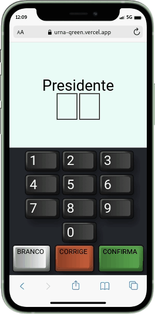

<h1 align="center">
    Urna
</h1>
<h4 align="center">ReactJs brasilian eletronic voting machine</h4>

<p align="center">
    
    
    
    
    
    <br>
</p>
<p align="center" style="background-image: url('./design/background.png');">
    
    
</p>

> ### Candidates
>
> - 10: Doguinho Caramelo
> - 28: Julius
> - 51: Agostinho Carrara
> - 72: Seu Madruga

## About this project

This project is part of my personal portfolio.

## Why?

The purpose of this project was to learn styled-components

## How to use

To clone and run this application, you'll need [Git](https://git-scm.com), [Node.js v14.19](https://nodejs.org/) or higher + [Yarn v1.22.15](https://yarnpkg.com/) or higher installed on your computer. From your command line:

```bash
#Cloning this respository
$ git clone https://github.com/RenanTRS/urna.git

#Go into the repository
$ cd urna

#Install dependencies
$ yarn
#or
$ npm install

#Run
$ yarn dev
#or
$ npm start
```

## Built With

- [Vite](https://vitejs.dev/guide/#scaffolding-your-first-vite-project)
- [ReactJs](https://reactjs.org/)
- [TypeScript](https://www.typescriptlang.org/)
- [styled-components](https://styled-components.com/)
- [EsLint](https://eslint.org/)
- [Prettier](https://prettier.io/docs/en/index.html)
- [Jest](https://jestjs.io/pt-BR/docs/getting-started)
- [Testing-library](https://testing-library.com/docs/)
- [@swc/jest](https://swc.rs/docs/usage/jest)
- [@swc/core](https://swc.rs/docs/usage/core)

## Contact

Email-me: renantrsouza@gmail.com  
Connect with me on [LinkedIn](https://www.linkedin.com/in/renantrsouza/)

## License

This project is licensed under the MIT License - see the [LICENSE.md](./LICENSE) file for details.
